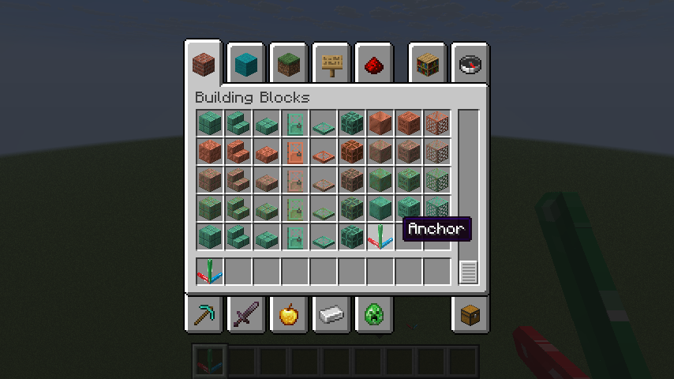

<p align="center">
  
</p>

English | [中文](README_zh.md)

# Builder

## Introduction

A Fabric mod that imports builds in bulk from specially formatted JSON files.

It was originally developed as a data importer for **the 3D model to Minecraft tool — [Minecraftify2.0](https://github.com/Ivans-11/Minecraftify2/)**, and is often used together with it.

Of course, this mod can also be used independently. As long as you can generate JSON files in the required format, you can import builds with this mod.

## Features

* Import blocks in bulk from JSON files located in the `config/mybuilds/` directory.
* Players can use the `builder:anchor_block` to set the origin and orientation of the relative coordinate system, allowing precise control over the placement and facing of imported blocks.
* Supports undo functionality to prevent mistakes. You can undo up to the last 3 build operations.

## Usage

1. Create a specially formatted JSON file under the `config/mybuilds/` directory, e.g. [`example.json`](./example.json)

   ```json
   // Example
   {
       "minecraft:stone": [[1, 0, 0],[2, 0, 0],[3, 0, 0]],
       "minecraft:oak_planks": [[0, 1, 1],[0, 1, 2]]
   }
   ```

   * Keys are block IDs, and values are arrays of relative coordinates.
   * You can use [**Minecraftify2.0**](https://github.com/Ivans-11/Minecraftify2/releases) to generate JSON files from 3D models. See its [repository documentation](https://github.com/Ivans-11/Minecraftify2) for details.

2. Place a `builder:anchor_block` in the game world to define the reference origin and orientation.

   

3. Run the command:

   ```
   /builder place example
   ```

   The structure will be generated at the nearest anchor block to the player.

   

4. To undo the last operation, run:

   ```
   /builder undo
   ```

   This will revert the most recent build (up to 3 steps).

## Command List

* `/builder place <name>`
  Import a build from `config/mybuilds/<name>.json`
* `/builder list`
  List all JSON files under the `config/mybuilds/` directory
* `/builder anchors`
  List the coordinates of all anchor blocks
* `/builder undo`
  Undo the most recent build operation

## Notes

* You must place an anchor block before generating a build. The mod will automatically find the anchor block closest to the player when placing structures.

* Anchor blocks can be found in the building blocks inventory tab.

  

* Undo only applies to blocks placed using the `/builder place` command, and does not affect manually placed blocks.

## Acknowledgements

This project is based on [FabricMC/fabric-example-mod](https://github.com/FabricMC/fabric-example-mod). 