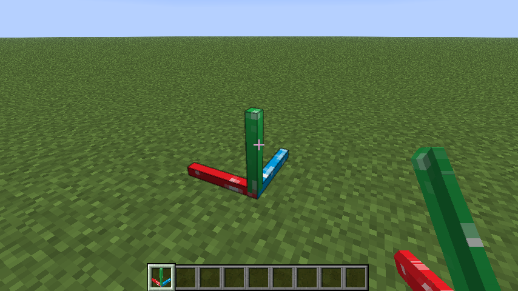

<p align="center">
  
</p>

English | [中文](README_zh.md)

# Builder

## Introduction

A Fabric mod that imports builds in bulk from specially formatted JSON files.

It was originally developed as a data importer for **the 3D model to Minecraft tool — [Minecraftify2.0](https://github.com/Ivans-11/Minecraftify2/)**, and is often used together with it.

Of course, this mod can also be used independently. As long as you can generate JSON files in the required format, you can import builds with this mod.

## Features

* Import blocks in bulk from JSON files located in the `config/mybuilds/` directory.
* Players can use the `builder:anchor_block` to set the origin and orientation of the relative coordinate system, allowing precise control over the placement and facing of imported blocks.
* Supports undo functionality to prevent mistakes. You can undo up to the last 3 build operations.
* Supports exporting blocks from the current world to JSON files.

## Usage

1. Create a specially formatted JSON file under the `config/mybuilds/` directory, e.g. [`example.json`](./example.json)
   * You can use [**Minecraftify2.0**](https://github.com/Ivans-11/Minecraftify2/releases) to generate JSON files from 3D models. See its [repository documentation](https://github.com/Ivans-11/Minecraftify2) for details.
   * You can also use the `/builder save` command to export JSON files from the current world. See the following content for specific usage.
   ```json
   {
       "minecraft:stone": [[1, 0, 0],[2, 0, 0],[3, 0, 0]],
       "minecraft:oak_planks": [[0, 1, 1],[0, 1, 2]],
       "minecraft:spruce_stairs":[[2, 0, 1, 3]],
       "minecraft:oak_log":[[3, 0, 1, -3],[4, 0, 1, -1]]
   }
   ```
   * Keys are block IDs, and values are arrays of relative coordinates.
   * Each element in the relative coordinate array represents a block's relative coordinates, in the format `[x, y, z, w]`.
     * `x` represents the offset in the x-axis relative to the origin.
     * `y` represents the offset in the y-axis relative to the origin.
     * `z` represents the offset in the z-axis relative to the origin.
     * `w` is an optional parameter, used to specify the direction of blocks with direction attributes.
       * When positive, it represents the horizontal direction. The corresponding numeric values correspond to the following image (for example, stairs):
        
       * When negative, it represents the axis direction. The corresponding numeric values correspond to the following image (for example, logs):
        

2. Place a `builder:anchor_block` in the game world to define the reference origin and orientation.

   

3. Run the command:

   ```
   /builder place example
   ```

   The structure will be generated at the nearest anchor block to the player.

   

4. To undo the last operation, run:

   ```
   /builder undo
   ```

   This will revert the most recent build (up to 3 steps).
5. If you need to export a build from the current world, enter:

   ```
   /builder save <x> <y> <z> <name>
   ```
   Where `<x> <y> <z>` represents the selected area range.

   The mod will use the nearest anchor block to the player as the starting point `(0,0,0)` and export the block data in the range from `(0,0,0)` to `(x,y,z)` to the `config/mybuilds/<name>.json` file.

   Note that the x-axis corresponds to the red axis, the y-axis corresponds to the green axis, and the z-axis corresponds to the blue axis. The format of the exported JSON file is the same as that of the imported one.

## Command List

* `/builder place <name>`
  Import a build from `config/mybuilds/<name>.json`
* `/builder list`
  List all JSON files under the `config/mybuilds/` directory
* `/builder anchors`
  List the coordinates of all anchor blocks
* `/builder undo`
  Undo the most recent build operation
* `/builder clear`
  Clear all anchor blocks
* `/builder save <x> <y> <z> <name>`
  Export the block data within the specified area to the `config/mybuilds/<name>.json` file.
* `/builder help`
  Show help information

## Notes

* You must place an anchor block before generating a build. The mod will automatically find the anchor block closest to the player when placing structures.

* Anchor blocks can be found in the building blocks inventory tab.

  

* Undo only applies to blocks placed using the `/builder place` command, and does not affect manually placed blocks.

* Since JSON files only record the relative coordinates of blocks, it is not possible to import some special blocks (such as buttons, doors, etc., which contain more information) accurately.

## Acknowledgements

This project is based on [FabricMC/fabric-example-mod](https://github.com/FabricMC/fabric-example-mod). 