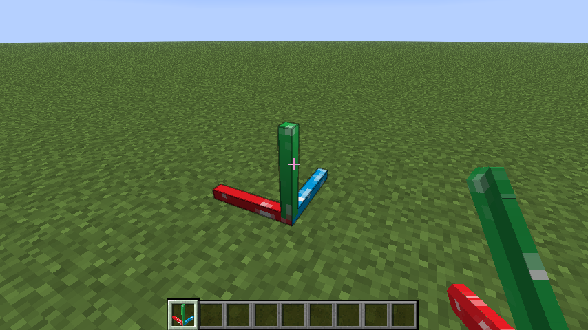
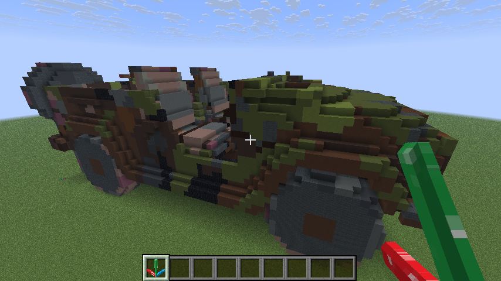
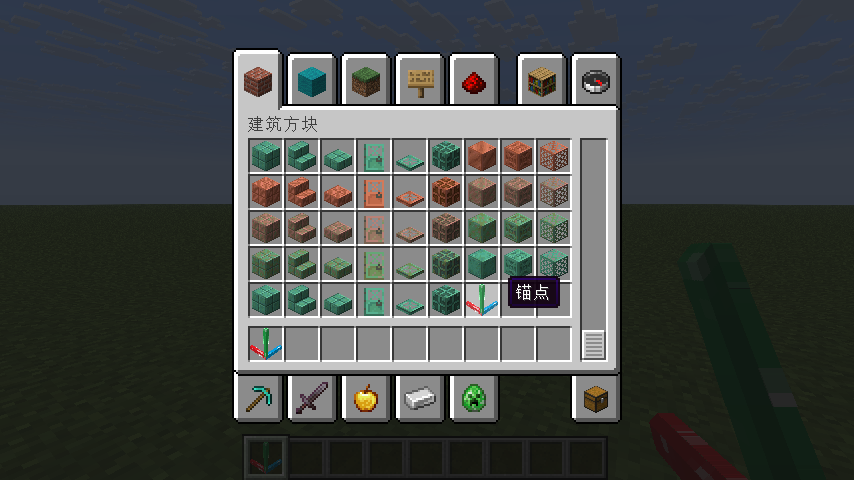

<p align="center">
  
</p>

[English](README.md) | 中文

# Builder

## 简介

一个通过特定格式的 JSON 文件批量导入建筑的 Fabric 模组

初衷是为 **三维模型转 Minecraft 工具 —— [Minecraftify2.0](https://github.com/Ivans-11/Minecraftify2/)** 而开发的数据导入模组，故常与其配合使用。

当然，本模组也可以单独使用。只要能生成符合格式的 JSON 文件，就可以使用本模组导入建筑。

## 功能
- 从 `config/mybuilds/` 目录下的 JSON 文件中批量导入方块。
- 玩家可以使用 `builder:anchor_block`（锚点方块）设置相对坐标系原点和朝向，从而精确地控制导入方块的位置与朝向。
- 支持撤回功能，避免误操作。最多可以撤回最近 3 次建造操作。
- 支持导出功能，将当前世界的指定区域内的方块数据导出为 JSON 文件。

## 使用方法

1. 在 `config/mybuilds/` 目录下创建特定格式的 JSON 文件，例如 [`example.json`](./example.json)
   - 可使用工具 [**Minecraftify2.0**](https://github.com/Ivans-11/Minecraftify2/releases) 从三维模型文件生成，具体使用方法见其[仓库说明](https://github.com/Ivans-11/Minecraftify2)。
   - 也可利用 `/builder save` 命令从当前世界导出 JSON 文件，具体使用方法见后文。
   ```json
    {
        "minecraft:stone": [[1, 0, 0],[2, 0, 0],[3, 0, 0]],
        "minecraft:oak_planks": [[0, 1, 1],[0, 1, 2]],
        "minecraft:spruce_stairs":[[2, 0, 1, 3]],
        "minecraft:oak_log":[[3, 0, 1, -3],[4, 0, 1, -1]]
    }
   ```
   - 其中，键为方块 ID，值为相对坐标数组。
   - 相对坐标数组中的每个元素表示一个方块的相对坐标，格式为 `[x, y, z, w]`。
     - `x` 表示相对于原点的 x 轴偏移量。
     - `y` 表示相对于原点的 y 轴偏移量。
     - `z` 表示相对于原点的 z 轴偏移量。
     - `w` 为可选参数，用于指定 带方向属性方块 的朝向。
       - 为正数时，代表水平朝向。具体数值对应关系如图（以楼梯为例）：
         
       - 为负数时，代表轴向。具体数值对应关系如图（以原木为例）：
         

2. 在游戏中放置一个 `builder:anchor_block`（锚点方块） ，用于确定参考坐标系原点和朝向。

    
3. 输入命令：

   ```
   /builder place example
   ```

   即可在距离玩家最近的锚点处生成建筑。

   
4. 如果需要撤回操作，输入：

   ```
   /builder undo
   ```

   将撤回最近一次生成操作（最多支持 3 步）。
5. 如果需要导出当前世界的建筑，输入：

   ```
   /builder save <x> <y> <z> <name>
   ```
   其中，`<x> <y> <z>` 为选择的区域范围
   模组将以距离玩家最近的锚点为起始点 `(0,0,0)` ，导出 `(0,0,0)` 到 `(x,y,z)` 范围内的方块数据到 `config/mybuilds/<name>.json` 文件中。
   注意，x 为红轴方向，y 为绿轴方向，z 为蓝轴方向。导出的 JSON 文件格式与导入的格式相同。

## 命令列表

- `/builder place <name>`
  从 `config/mybuilds/<name>.json` 导入建筑
- `/builder list`
  列出 `config/mybuilds/` 目录下的所有 JSON 文件
- `/builder anchors`
  列出所有锚点方块的坐标
- `/builder undo`
  撤回最近一次生成操作
- `/builder clear`
  清除所有锚点方块
- `/builder save <x> <y> <z> <name>`
  导出指定区域内的方块数据到 `config/mybuilds/<name>.json` 文件中
- `/builder help`
  显示帮助信息

## 注意

- 必须先放置锚点方块才能生成建筑，生成建筑时会自动寻找距离玩家最近的锚点方块。
- 锚点方块可在建筑方块物品栏中找到。

    
- 撤回仅能恢复由 `/builder place` 命令生成的方块，不影响手动放置的方块。
- 由于 JSON 文件只记录了方块的相对坐标和朝向，因此对于一些特殊的方块（如按钮、门等包含更多信息的方块），无法做到精确导入。

## 致谢

本项目基于 [FabricMC/fabric-example-mod](https://github.com/FabricMC/fabric-example-mod) 开发。